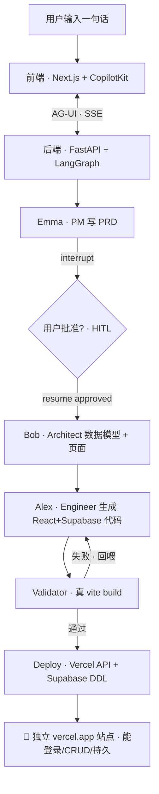

# atoms

> 一支 AI 产品团队。用自然语言生成**可运行、可登录、可分享**的全栈应用 —— 几分钟从想法到真能注册登录的 `vercel.app` 站点。

**📍 在线演示**:[atoms-demo-loyd.vercel.app](https://atoms-demo-loyd.vercel.app) · **源码**:[github.com/tech-loyd/atoms-demo](https://github.com/tech-loyd/atoms-demo)

---

## 30 秒看懂

输入「**做一个习惯打卡应用**」→ 看一支 AI 团队像真人研发一样协作:

- **Emma(PM)** 写 PRD → 你批准(HITL)
- **Bob(架构师)** 设计数据模型 + 页面
- **Alex(工程师)** 生成 React + Supabase 代码
- **Validator** 跑真 `vite build`,失败回喂 Alex 重写
- **Deploy** 调 Vercel API,一键交付一个能注册、登录、打卡、数据持久的真站点

## 亲自试一下

打开[演示链接](https://atoms-demo-loyd.vercel.app),在欢迎页输入需求(或点示例)。推荐这几个,效果比较完整:

- 「做一个习惯打卡应用」
- 「做一个迷你商城,能加购物车下单」
- 「做一个咖啡品牌官网」

**体验路径**:输入 → 工作区 **Design** 视图流式出 PRD → 点**批准** → **Code** 视图实时生成源码 → **Preview** 自动切到运行预览 → 点**部署** → 拿到真 `vercel.app` 站点。

---

## 我如何理解 atoms

[atoms.dev](https://atoms.dev) 的定位是「下一代 AI Agent 平台」。我理解的**本质不是"代码生成器",而是一支自动化的 AI 产品团队** —— 和单次 LLM 生成代码的区别:

| | 单 LLM 生成代码 | atoms 模式 |
|---|---|---|
| 过程 | 一次性 prompt → 代码 | 多角色 agent 按研发 SOP 协作 |
| 质量 | 无保证 | 每步产物进状态,构建校验,失败回喂重写 |
| 产物 | 代码片段 | 可运行、可登录、可分享的真站点 |

所以 demo 要复刻的「原子能力」是三件事:

1. **Agent 编排** —— 状态机驱动的多角色 SOP(PM → Architect → Engineer),不是一次 LLM 调用
2. **工程闭环** —— 构建校验 + 失败回喂,这是区分"玩具 demo"和"可交付产品"的关键
3. **真实交付** —— 产出是真能注册、登录、CRUD 的全栈应用,一键上真站点,不是单文件玩具

---

## 架构与选型



**关键选型理由**(为什么是它,不是别的):

| 层 | 选型 | 为什么 |
|---|---|---|
| Agent 编排 | **LangGraph** | 状态机 + `interrupt` 原生支持 HITL,工程级可控、可观测;不选 MetaGPT(角色抽象重、执行可控性弱) |
| 前后端协议 | **AG-UI + `forwardedProps` 确定性触发** | 首轮 / 批准 / 部署不靠 LLM 解析自然语言意图,走确定路径,稳定可复现 |
| 后端 | **FastAPI + Docker 双 runtime** | Python 承载编排,Node 子进程跑真 `vite build`,一个容器装下两套运行时 |
| 生成物后端 | **Supabase 单层(Auth + Postgres)** | atoms 自身无状态,多租户用表前缀 + RLS,免维护独立库 |
| 部署 | **Vercel API(inlined files)** | 免 git,按生成物动态建独立站点,符合"一键交付"语义 |

---

## 这不只是 prompt 包装

四个「真」,每个都是区分 demo 玩具和可交付产品的分水岭:

- **真·编排** —— LangGraph 状态机驱动三角色 SOP,每步产物进 `GraphState`,前端经 AG-UI `STATE_SNAPSHOT` 实时回流;HITL 在 PRD 后真正 `interrupt` 暂停等批准,不是预设脚本。
- **真·构建** —— 容器里起 Node 子进程跑真实 `vite build`,失败把错误日志回喂 Alex 重写(最多 3 次),不是正则 / AST 糊弄的"校验"。
- **真·部署** —— 调 Vercel API `POST /v13/deployments`(inlined files,免 git)建独立 `vercel.app` 站点;Supabase Management API 按 LLM 产出的数据模型动态建表 + RLS。
- **真·全栈** —— 生成物是 React + Vite + Tailwind + Supabase,真能注册、登录、CRUD、数据持久。

## 工作流:三角色 SOP

```
用户需求
   │
   ▼
Emma(PM) ──write_prd──▶ state.prd
   │
   ▼
approve_prd ──interrupt──▶ ⏸ 等用户批准(HITL)
   │ (resume {approved: true})
   ▼
Bob(Architect) ──write_design──▶ state.design(数据模型 + 页面)
   │
   ▼
Alex(Engineer) ──write_code──▶ state.files(React + Supabase 源码)
   │
   ▼
Validator ──vite build──▶ 通过 / 失败回喂(最多 3 次)
   │
   ▼
Deploy ──Vercel API + Supabase DDL──▶ vercel.app 真站点
```

每步产物都写入 `GraphState`,前端订阅同一 agent 实例,`STATE_SNAPSHOT` 自动推送,工作区实时看到产物流转。

### 前端:工作区三视图

- **Design** —— Emma 的 PRD 卡片 + 批准入口 + Bob 的设计(前后端分层 + 数据库 ER + 外键关系)
- **Code** —— Alex 生成的源码(文件树 + Prism 高亮,实时跟随生成)
- **Preview** —— 运行应用(后端 build 产物 iframe / Vercel 部署站点,按就绪状态自动切)

欢迎页(`/`)输入需求,带参跳到工作区(`/workspace`)自动触发生成;生成期间停在 Design,代码写完自动切 Preview。

## 技术栈

| 层 | 技术 |
|---|---|
| 前端 | Next.js 15 · CopilotKit · Tailwind |
| 后端 | Python · FastAPI · LangGraph · ag-ui-langgraph |
| 生成物 | React · Vite · Tailwind · Supabase(Auth + Postgres) |
| 部署 | Vercel API(inlined files)· Supabase Management API(动态 DDL) |
| LLM | 智谱 GLM-5.2(Anthropic 兼容 API,可一行换 Claude) |

## 可扩展性

当前是一个聚焦的核心闭环,留了几个明确的扩展方向:

- **更多角色** —— 加测试工程师(跑生成物的 e2e)、运维(自动监控上线站点),SOP 节点天然可插拔
- **多框架生成** —— Alex 的输出模板化,Vue / Svelte / 移动端只是多一套 starter
- **生成物的版本 / 团队协作** —— 把每次生成挂到用户账号,支持 fork、迭代、分享
- **模板市场** —— 用户自定义起点(如「带支付的电商底座」),从模板继续生成
- **更复杂需求** —— 多页面、工作流、权限模型,扩展 Engineer 的 prompt + schema

## 本地开发

### 后端

```bash
cd backend
python3.12 -m venv .venv && source .venv/bin/activate
pip install -r requirements.txt
cp .env.example .env   # 填 key(见下)
uvicorn app.main:app --port 8000
```

`.env` 需要:`ANTHROPIC_API_KEY` + `ANTHROPIC_BASE_URL` + `ANTHROPIC_MODEL`(LLM)、`VERCEL_TOKEN`(部署)、`SUPABASE_URL` + `SUPABASE_ANON_KEY`(生成物后端)、`SUPABASE_ACCESS_TOKEN`(PAT,动态建表,可选)。

### 前端

```bash
pnpm install
pnpm dev   # http://localhost:3000
```

> 已部署版:前端 [atoms-demo-loyd.vercel.app](https://atoms-demo-loyd.vercel.app),后端 Railway。

## 项目结构

```
backend/
  app/           FastAPI + LangGraph:agent / tools(SOP)/ validator(真 build)/ deploy(Vercel+Supabase)
  templates/     生成应用的 Vite + React + Tailwind 项目模板
  tests/         单元 + 集成测试(动态建表、validator、deploy、SOP HITL 等)
  railway.json   Railway 部署配置(Dockerfile builder + startCommand)
frontend/
  src/
    app/         路由:/(欢迎页)· /workspace(工作区)
    components/  Canvas(三视图)/ ChatPanel / PRDCard / DesignCard / CodeView / ...
    lib/         useApproval / useDeploy(HITL + 部署的 AG-UI 触发)/ types / 常量
```
